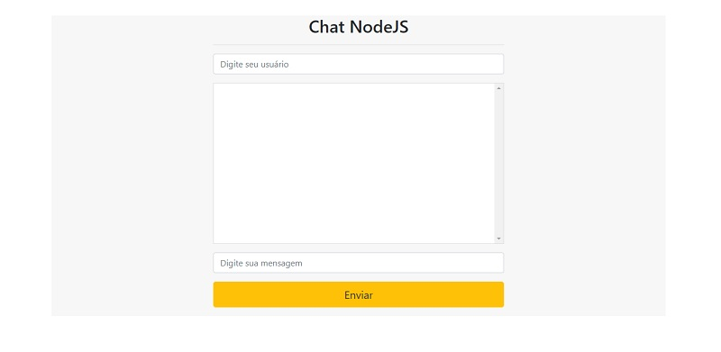

# Chat NodeJS :speech_balloon:

Este repositório contém um projeto Chat feito com NodeJS.

## Características
- [Socket.io](https://socket.io) para comunicação
- [Express](http://expressjs.com/pt-br/) Framework
- [EJS](http://ejs.co) Template Node 
- [Bootstrap 4](https://getbootstrap.com/docs/4.0/getting-started/introduction/)

## Rodando Aplicação

1. Instalar as dependências com npm:
`npm install`

2. Subir o servidor via NodeJS, no terminal executar:
`node server.js`

> Dica: teste com mais de uma pessoa conectada!! ou abra duas abas no seu navegador rs

Abrir navegador em http://localhost:3000/.